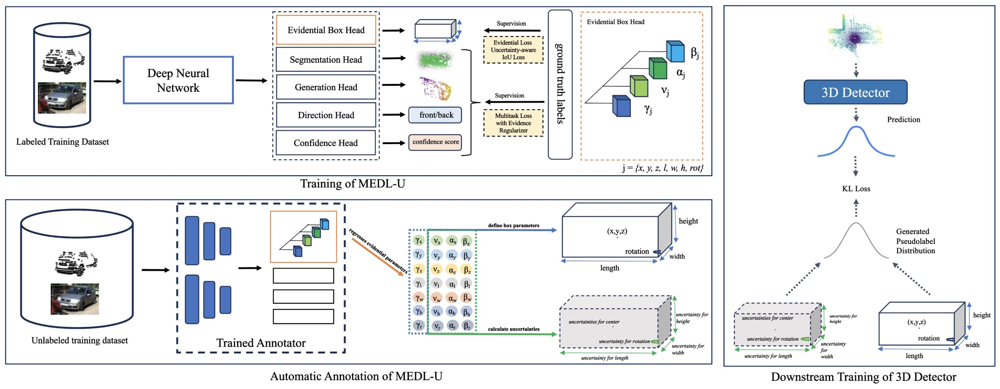

# MEDL-U
[ICRA 2024] The PyTorch implementation of 'MEDL-U: Uncertainty-aware 3D Automatic Annotation based on Evidential Deep Learning.'



## Data Preparation
The KITTI 3D detection dataset can be downloaded from the official website: [link](http://www.cvlibs.net/datasets/kitti/eval_object.php?obj_benchmark=3d).

## Train
Modify the config at /configs/MTrans_kitti.yaml

To train a MTrans with the KITTI dataset. Simply run:
> python train.py --cfg_file configs/MTrans_kitti.yaml

## Pretrained Model
You can download the pretrained model here: [link](https://drive.google.com/file/d/1-tzkSk0CdMg9B95b-i4eaTcpahCF3EG8/view?usp=sharing)

## Generate Pseudolabels
To generate pseudolabels, make sure that the 'best_model.pt' is saved in the experiment_name/ckpt folder. Simply run:
> python train.py --cfg_file configs/MTrans_kitti_gen_label.yaml

## References
This work is based from MTrans ("https://github.com/Cliu2/MTrans"). We thank the authors for their open-source code. 

## TODO

# Citation
```
@inproceedings{Paat2023MEDLUU3,
  title={MEDL-U: Uncertainty-aware 3D Automatic Annotation based on Evidential Deep Learning},
  author={Helbert Paat and Qing Lian and Weilong Yao and Tong Zhang},
  booktitle={ICRA},
  year={2024}
}
```
